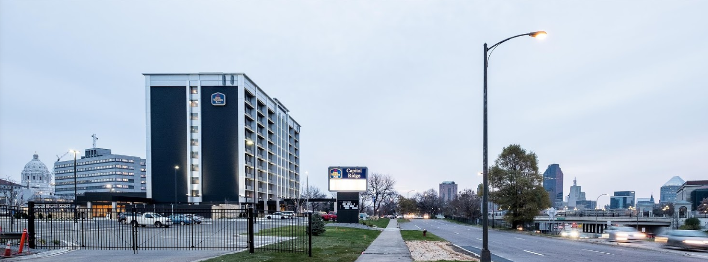

<h2 align="center"> Hotel and Travel Information </h2>

---

<!-- Coming soon! -->

### Hotel block

We have a block of rooms reserved for the nights of September 2 and 3 at the [Best Western Plus Capitol Ridge](https://www.bestwestern.com/en_US/book/hotels-in-saint-paul/best-western-plus-capitol-ridge/propertyCode.24104.html). 
This hotel is close to our wedding venue and recently renovated, with free parking and access to [light rail](https://www.metrotransit.org/metro-green-line). 

The rooms in the block will be held at the discounted rate of $149/night through August 2. Most of the rooms have 2 queen beds, and some have 1 king. 

**To book a room in our block, call the hotel at (651) 227-8711, and mention one of our names.** For the best views, ask for a room facing south or west! The discounted block rate is not available through online booking.

A shuttle will run between the hotel and the venue before and after the wedding. More details [here](wedding.html#shuttles). (You can also use [bike share](https://secure.niceridemn.org/) to get to and from the wedding site if you so desire!)

Here are a few additional suggestions for hotels if you would like to look into other options: 

- [Best Western Plus Como Park](http://www.bestwesternsaintpaul.com/): The closest hotel to the wedding venue. A nice hotel, but they require a 3-night minimum stay over Labor Day weekend due to the State Fair.
- [Country Inn Roseville](https://www.countryinns.com/roseville-hotel-mn-55113/usarvmn): Another hotel close to the venue in a quieter location.
- [Hampton Inn St. Paul](http://hamptoninn3.hilton.com/en/hotels/minnesota/hampton-inn-and-suites-downtown-st-paul-MSPDOHX/event/index.html): Located more centrally in downtown St. Paul. Close to Xcel Energy center, bars and breweries, Science Museum, etc.
- [Best Western Plus Bloomington](http://www.bestwesternbloomington.com): If you need to make a trip to the Mall of America...

### A few Minnesota weekend activity ideas for out-of-town visitors
- Hang out at one of the Twin Cities' many craft breweries. We'll be at [Bad Weather Brewing](www.badweatherbrewery.com) to welcome you and kick off the celebrations on Saturday between 4 and 6pm. 
- Visit the Great Minnesota Get-Together (aka the [State Fair](http://www.mnstatefair.org/))! 
It's the largest state fair in the country and it runs August 24-September 4 in St. Paul. 

<iframe width="400" height="225" src="https://www.youtube.com/embed/ZlbvOO0WQUE" frameborder="0" allowfullscreen></iframe>

- Visit [Como Zoo and Conservatory](http://www.comozooconservatory.org/) - a small zoo and greenhouse in the same park as our venue.

- Visit downtown St. Paul attractions near our hotel like the [Science Museum](https://www.smm.org/), [Minnesota History Center](http://www.minnesotahistorycenter.org/), and the [St. Paul Farmers Market](http://www.stpaulfarmersmarket.com/) (Saturdays 6am-1pm and Sundays 8am-1pm). 

- Take the Green Line light rail train across the river to Minneapolis for Twins baseball, more museums, etc.

<!-- 
There are several options to get to the wedding from the hotel, so you shouldn't need to rent a car if you are flying:
- We have reserved the hotel shuttle for the whole day
- Lyft/Uber/taxi
- For the ambitious, there are also bike share kiosks directly adjacent to both the hotel and the wedding venue :)
 -->

