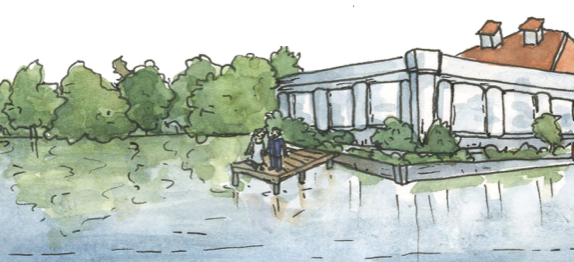

<h2 align="center"> The Wedding </h2>

----

<!--  -->

Our wedding ceremony will take place at 4pm at the Como Dockside pavilion in St. Paul's Como Park, with a reception following at the same location. 

<iframe src="https://www.google.com/maps/embed?pb=!1m14!1m8!1m3!1d2822.11131912174!2d-93.1441629!3d44.9820497!3m2!1i1024!2i768!4f13.1!3m3!1m2!1s0x52b32b1dac9bab27%3A0xb4264e0af6d64510!2sComo+Dockside!5e0!3m2!1sen!2sus!4v1486357064178" width="400" height="250" frameborder="0" style="border:0" allowfullscreen></iframe>
<!-- [Map](https://www.google.com/maps/place/Como+Dockside/@44.9820497,-93.1441629,17z/data=!4m5!3m4!1s0x52b32b1dac9bab27:0xb4264e0af6d64510!8m2!3d44.9822356!4d-93.1431115) -->

<h3 id="shuttles"> Shuttle </h3>

Shuttles will run between the hotel and the venue before and after the wedding. 

**Before the wedding:** The first shuttles will leave the hotel at 2:45pm and will run continuously for an hour. The drive is about 10 minutes. The final shuttle will leave around 3:40. 

We strongly encourage you to plan to get on the shuttle before 3:20 if you can, so that there is room for everyone who wants a ride. If you arrive early, Como Park is very nice to walk around.

There will also be a shuttle going from the hotel to the State Fair at the same time, so it would be a good idea to check that you're getting on the right one.

**After the wedding:** A shuttle will run between the venue and the hotel starting at around 10pm. The last shuttle will leave at 11:40pm.

 

### Parking

There are parking lots on both sides of the pavilion. If these lots are full, you can also park in the golf course lot on the other side of Lexington Parkway. 

The wedding entrance will be on the north side of the pavilion.

**Attire:** Relaxed summer wedding 

-----

### Happy hour!

You're welcome to join other guests for snacks and drinks on Saturday, September 2 at [Bad Weather Brewing](www.badweatherbrewery.com) in St. Paul. 
The bride and groom will be there between 4 and 6pm. 

<!-- 
----

Get in touch with one of us anytime if you have questions about the event!
 

 -->
 
 
 
